# Sansad — Rajya Sabha Member Information System

[](https://react.dev)
[](https://vitejs.dev)
[](https://fastapi.tiangolo.com)
[](https://tailwindcss.com)
[](https://vitest.dev)
[](https://www.mysql.com)
[](https://www.python.org)
[](./LICENSE)

> **Structured, searchable, and visually rich access to Rajya Sabha parliamentary data — for citizens, researchers, and civic technologists.**

Sansad aggregates fragmented parliamentary activity data from Rajya Sabha members into a unified system: a secured REST API backed by a relational database, and a React single-page application that makes the data browsable, filterable, and analytically meaningful. Where the official portal serves rendered HTML across dozens of disconnected pages, Sansad delivers structured JSON, computed analytics, and an 11-tab per-member profile portal — all from a single platform.

---

## Table of Contents

- [Screenshots](#screenshots)
- [Features](#features)
- [Tech Stack](#tech-stack)
- [Architecture](#architecture)
- [API Documentation](#api-documentation)
- [Project Structure](#project-structure)
- [Installation](#installation)
- [Environment Variables](#environment-variables)
- [Running the Project](#running-the-project)
- [Testing](#testing)
- [Performance Optimizations](#performance-optimizations)
- [Security](#security)
- [Deployment](#deployment)
- [Challenges Solved](#challenges-solved)
- [Future Improvements](#future-improvements)
- [Contributors](#contributors)
- [License](#license)

---

## Screenshots

| Home — Member Search | Member Dashboard | Questions Tab |
|---|---|---|
| 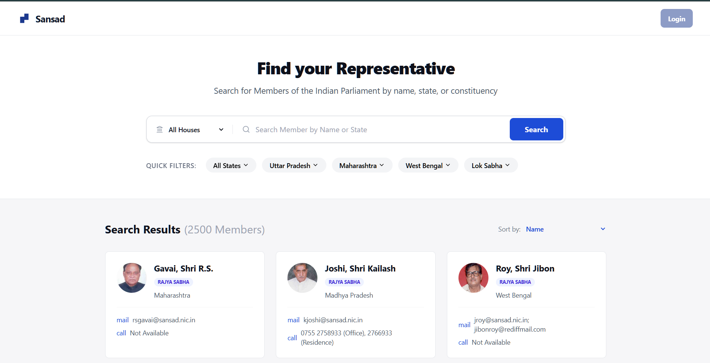 | 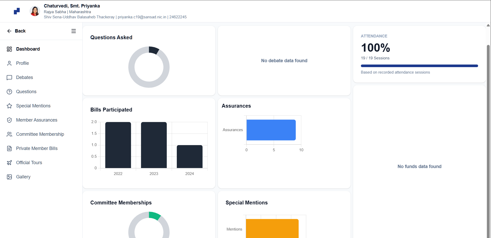 | 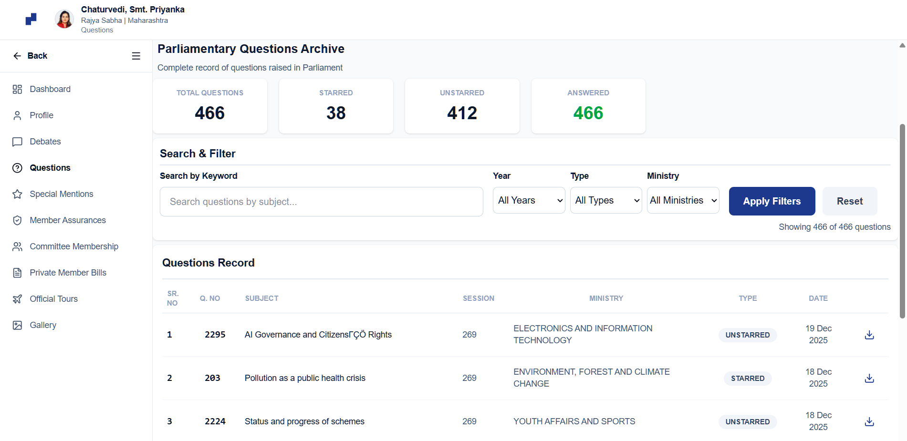 |

| Member Profile | Debates Tab | Special Mentions Tab |
|---|---|---|
| 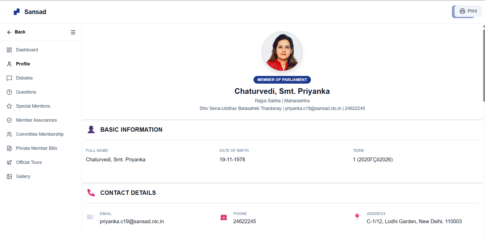 | 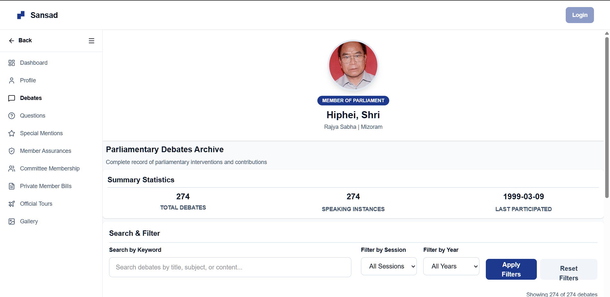 | 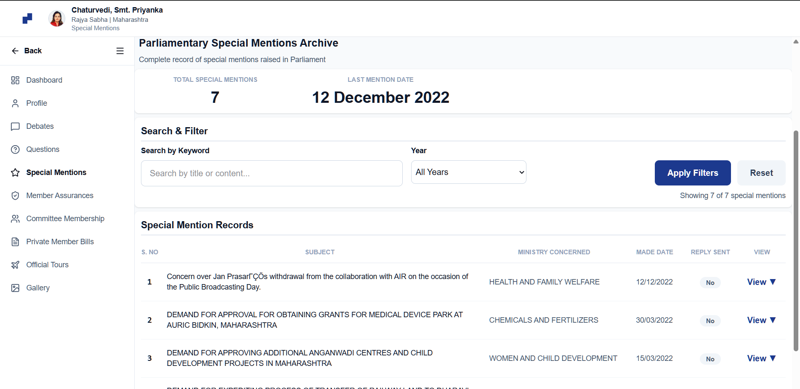 |

| Assurances Tab | Committee Membership | Private Bills Tab |
|---|---|---|
| 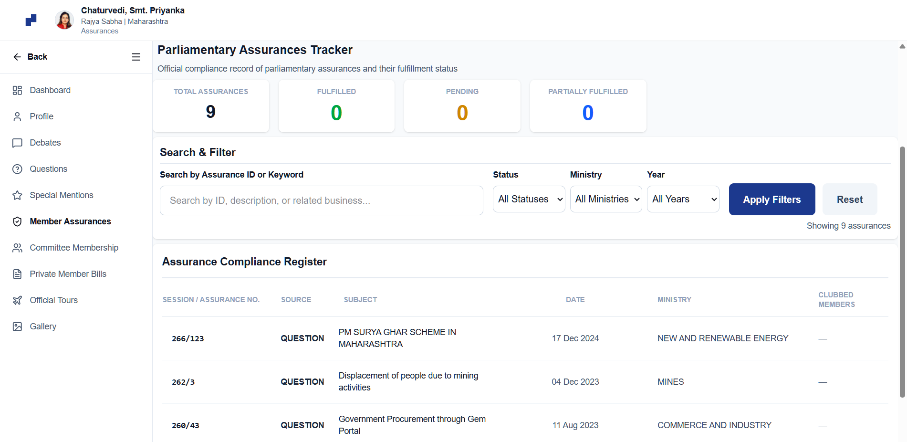 | 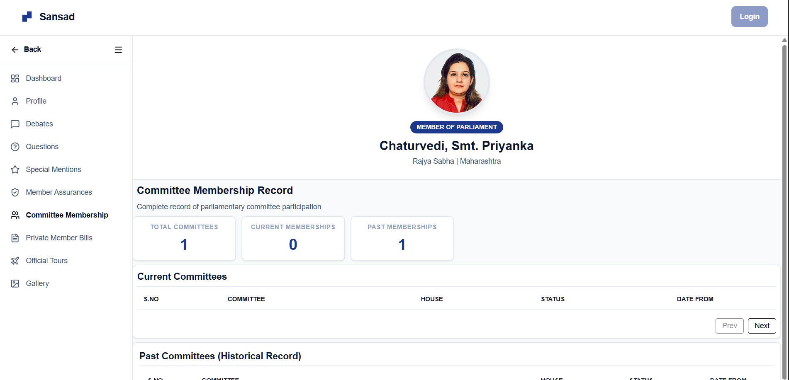 | 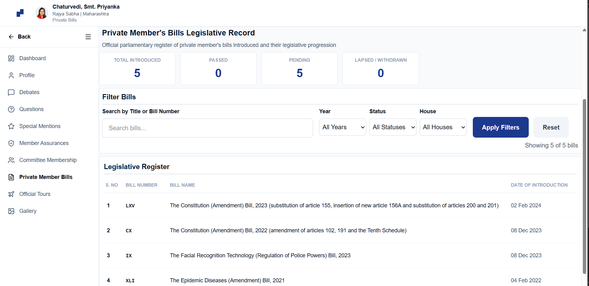 |

| Official Tours Tab | Gallery Tab | |
|---|---|---|
| 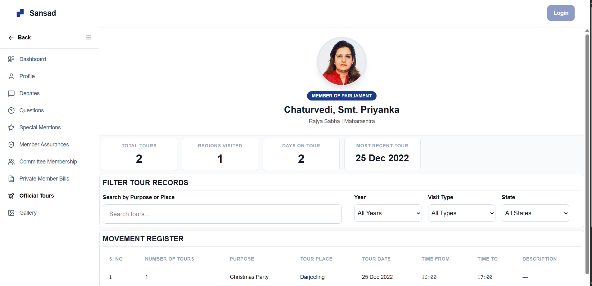 | 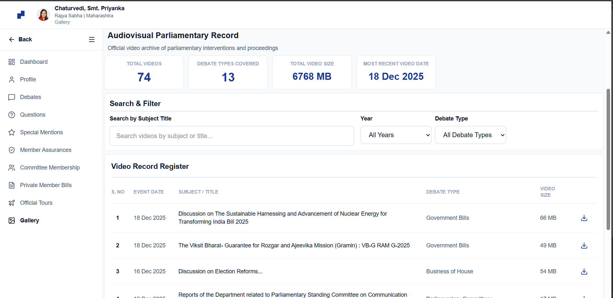 | |

---

## Features

### Frontend

- **Member listing** — server-paginated card grid of all 500+ Rajya Sabha members with real-time client-side search
- **11-tab per-member profile portal** — Dashboard, Profile, Attendance, Debates, Questions, Special Mentions, Assurances, Committees, Private Bills, Tours, Gallery
- **Advanced client-side filtering** per tab:
  - Questions: keyword, year, type (Starred/Unstarred), ministry
  - Assurances: status, ministry, year
  - Committees: automatically split into current and past by date
  - Private Bills: year, status, house
  - Tours: year, visit type, state
  - Gallery: year, debate type
  - Special Mentions: keyword, year
- **Aggregated performance dashboard** — attendance %, starred vs unstarred split, debates per year, bills by year, all computed client-side from raw API data
- **Chart.js visualisations** for all trend data
- **Lazy-loaded feature routes** via `React.lazy()` + `Suspense` — each of the 11 tabs loads its JS bundle on first visit only
- **Client-side pagination** with ellipsis-aware page range generation
- **CORS image proxy** — member photos served through `/proxy/image` to bypass sansad.in restrictions
- **XSS prevention** via DOMPurify on all HTML-bearing API fields
- **Modular feature architecture** — each feature is fully self-contained with its own components, hook, mapper, API layer, and tests

### Backend

- **18 REST endpoints** — 2 public, 15 authenticated, 1 unauthenticated image proxy
- **Generic `fetch_table` function** backing 13 endpoints with zero boilerplate
- **Server-side pagination** on `/members` (configurable `page` and `limit`)
- **Image proxy** with spoofed `Referer` and `User-Agent` headers via `httpx`
- **Automatic Swagger/OpenAPI docs** at `/docs`

### Security

- **API key authentication** on all data endpoints via `X-API-Key` HTTP header
- **Rate limiting** — 100 requests/minute per IP on `/members` and `/members/{srno}` via SlowAPI
- **Environment-based credential management** via `python-dotenv`
- **DOMPurify** sanitisation on the frontend for API-sourced HTML content

### Performance

- **30-minute sessionStorage cache** with TTL on all feature data
- **In-flight request deduplication** — concurrent requests for the same cache key share one Promise
- **10-parallel API calls** in `getMemberDataMap()` via `Promise.all`
- **7-parallel API calls** in `buildMemberDashboard()` via `Promise.all`
- **Per-feature 2–3 parallel calls** on every tab mount
- **Code splitting** — all 11 feature route components are individually lazy-loaded

### Testing

- **Vitest 4.1.5** frontend test runner with jsdom environment
- **React Testing Library** for component rendering tests
- **Unit tests** for hooks, data mappers, and components in the `attendance` feature module
- **Python `unittest` + `httpx`** integration test suite with 7 test classes against a live API
- **v8 coverage** reporting in text + lcov formats

---

## Tech Stack

### Frontend

| Technology | Version | Purpose |
|---|---|---|
| React | 19.2.0 | UI component framework |
| Vite | 7.2.4 | Build tool and dev server |
| React Router DOM | 7.13.0 | Client-side SPA routing |
| Tailwind CSS | 4.1.18 | Utility-first styling |
| Chart.js | 4.5.1 | Data visualisation charts |
| Lucide React | 0.563.0 | Icon library |
| DOMPurify | 3.3.1 | XSS sanitisation |

### Backend

| Technology | Version | Purpose |
|---|---|---|
| FastAPI | 0.104.1 | REST API framework |
| Uvicorn | 0.24.0 | ASGI server |
| mysql-connector-python | 8.2.0 | MySQL database driver |
| SlowAPI | 0.1.9 | Rate limiting middleware |
| httpx | latest | Async HTTP client (image proxy) |
| python-dotenv | 1.0.0 | Environment variable loading |

### Database

| Technology | Version | Purpose |
|---|---|---|
| MySQL | 8.0 | Relational database (14 tables) |

### Testing & Tooling

| Technology | Version | Purpose |
|---|---|---|
| Vitest | 4.1.5 | Frontend unit/component test runner |
| @testing-library/react | 16.3.2 | React component testing utilities |
| @testing-library/user-event | 14.6.1 | User interaction simulation |
| @vitest/coverage-v8 | 4.1.5 | Coverage reporting |
| jsdom | 29.1.1 | DOM simulation for tests |
| ESLint | 9.39.1 | JavaScript linting |

### Deployment

| Tool | Purpose |
|---|---|
| Procfile | Heroku/Render process definition |
| Vite build | Static frontend bundle |

---

## Architecture

### System Overview

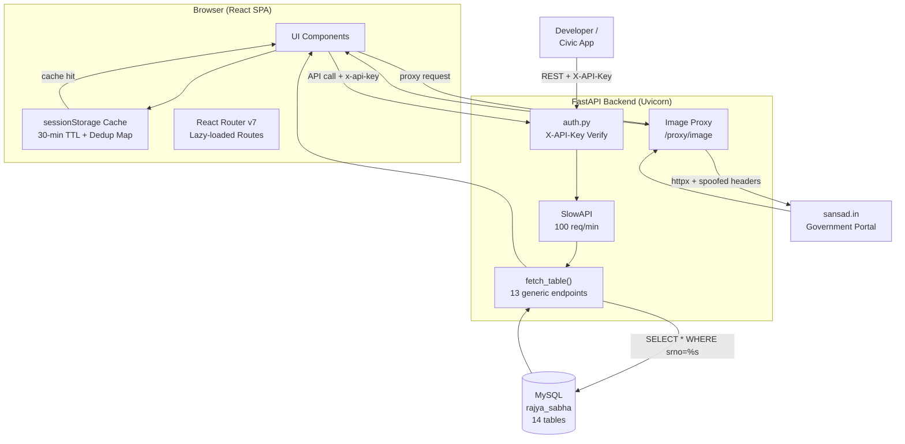

### Request Lifecycle

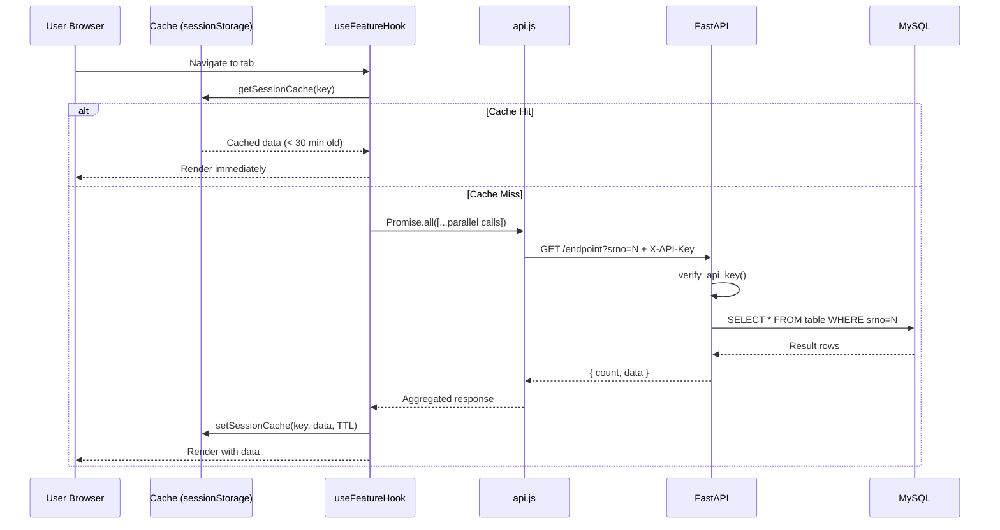

### Frontend Modular Architecture

```mermaid
graph LR
    subgraph App["App Layer"]
        Main["main.jsx"]
        AppC["App.jsx"]
        Routes["routes/index.jsx"]
    end

    subgraph Shared["Shared Layer (@/shared)"]
        Services["services/\nhttpClient · api · request · errorHandler"]
        Utils["utils/\ncache · pagination · chartSetup · formatters"]
        Components["components/\nErrorBoundary · LoadingState\nEmptyState · PageHeading · SectionPanel"]
        Constants["constants/"]
    end

    subgraph Config["Config Layer (@/config)"]
        ApiConf["api.config.js\nBASE_URL · API_KEY · TIMEOUT"]
        RouteConf["routes.js\nRoute constants + builders"]
        ThemeConf["theme.config.js"]
    end

    subgraph Features["Feature Modules (@/features)"]
        Att["attendance/\nhooks · components · api · mapper · tests"]
        Que["questions/\nhooks · components"]
        Deb["debates/\nhooks · components"]
        Com["committees/\nhooks · components"]
        Pro["profile/\nhooks · components"]
        Ass["assurances/\nhooks · components"]
        SM["specialmentions/\nhooks · components"]
        PB["privatebills/\nhooks · components"]
        Gal["gallery/\nhooks · components"]
        Tou["tours/\nhooks · components"]
        Dash["dashboard/\ncomponents"]
        Home["home/\nSearch · PersonHorizontalCard"]
    end

    App --> Shared
    App --> Config
    App --> Features
    Features --> Shared
    Features --> Config
```

### Data Caching Flow

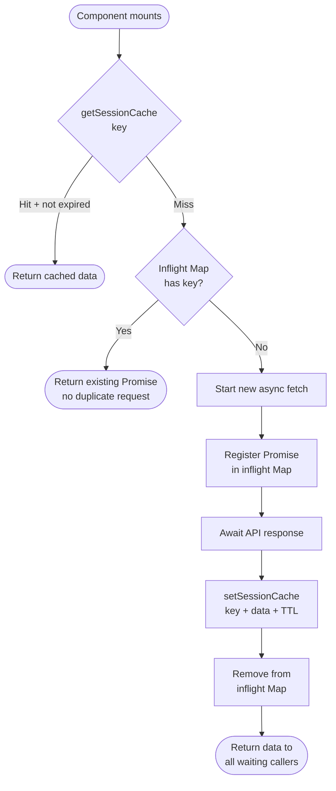

---

## API Documentation

### Base URL

```
Development:  http://localhost:8000
Production:   https://your-deployment.onrender.com
```

> All authenticated endpoints require the `X-API-Key` header.

### Endpoints

| Method | Endpoint | Auth | Rate Limit | Description |
|---|---|---|---|---|
| `GET` | `/` | No | — | Welcome message + API version |
| `GET` | `/health` | No | — | Database connectivity check |
| `GET` | `/proxy/image?url=` | No | — | CORS proxy for sansad.in images |
| `GET` | `/members` | Yes | 100/min | Paginated member list |
| `GET` | `/members/{srno}` | Yes | 100/min | Single member by serial number |
| `GET` | `/member-dashboard` | Yes | — | Pre-aggregated dashboard data |
| `GET` | `/member-personal-details` | Yes | — | Personal biographical info |
| `GET` | `/member-other-details` | Yes | — | Supplementary member details |
| `GET` | `/member-questions` | Yes | — | Starred and unstarred questions |
| `GET` | `/member-debates` | Yes | — | Parliamentary debate records |
| `GET` | `/member-special-mentions` | Yes | — | Special mention records |
| `GET` | `/assurance` | Yes | — | Parliamentary assurances |
| `GET` | `/member-committees` | Yes | — | Committee memberships |
| `GET` | `/member-bills` | Yes | — | Private member bills |
| `GET` | `/member-attendance` | Yes | — | Session-wise attendance |
| `GET` | `/mp-tour` | Yes | — | Official tour records |
| `GET` | `/gallery` | Yes | — | Member photo/media gallery |
| `GET` | `/education-levels` | Yes | — | Education levels lookup table |

### Query Parameters

**`GET /members`**
```
page    integer  default=1   Page number
limit   integer  default=50  Records per page
```

**All per-member endpoints (except `/education-levels`):**
```
srno    integer  required    Member serial number
```

### Response Structure

**`GET /members`**
```json
{
  "total": 550,
  "page": 1,
  "data": [
    {
      "srno": 2,
      "mpcode": 10045,
      "member_name": "Example Member",
      "party": "Party Name",
      "state_ut": "State Name",
      "status": "Sitting",
      "age": 62,
      "term": "2018-2024",
      "image_url": "https://sansad.in/..."
    }
  ]
}
```

**All `fetch_table` endpoints**
```json
{
  "count": 42,
  "data": [ { ...fields } ]
}
```

### Error Responses

| Status | Condition | Body |
|---|---|---|
| `401` | Missing or invalid `X-API-Key` | `{ "detail": "Invalid or missing API key" }` |
| `404` | Member `srno` not found | `{ "detail": "Member not found" }` |
| `429` | Rate limit exceeded (100/min) | `{ "detail": "Rate limit exceeded" }` |
| `400` | Invalid image URL in proxy | `{ "detail": "Invalid image URL: must be an absolute http/https URL" }` |
| `502` | Upstream image fetch failed | `{ "detail": "Failed to fetch remote image: ..." }` |

### Authentication Example

```bash
curl -H "X-API-Key: your-api-key" \
     "http://localhost:8000/members?page=1&limit=10"
```

```bash
curl -H "X-API-Key: your-api-key" \
     "http://localhost:8000/member-questions?srno=2"
```

---

## Project Structure

```
sansad-college/
├── frontend/                         # React + Vite application
│   ├── package.json
│   ├── vite.config.js                # Path aliases, proxy, test config
│   ├── tailwind.config.js            # Design tokens
│   ├── eslint.config.js
│   ├── index.html
│   └── src/
│       ├── main.jsx                  # Entry: StrictMode + BrowserRouter
│       ├── App.jsx                   # Root: ScrollProvider + Navbar + Routes + Footer
│       ├── config/
│       │   ├── api.config.js         # API_BASE_URL, API_KEY, API_TIMEOUT_MS
│       │   ├── routes.js             # ROUTES constants + buildPersonRoute()
│       │   └── theme.config.js       # Design tokens
│       ├── shared/
│       │   ├── services/
│       │   │   ├── httpClient.js     # httpGet() with timeout + auth header
│       │   │   ├── api.js            # Re-exports from utils/api.js
│       │   │   ├── request.js        # useRequest() hook + cachedRequest()
│       │   │   └── errorHandler.js   # normalizeError() + getErrorMessage()
│       │   ├── utils/
│       │   │   ├── cache.js          # cachedAsync() + sessionStorage TTL + dedup Map
│       │   │   ├── pagination.js     # getPaginationRange()
│       │   │   ├── chartSetup.js     # Chart.js global registration
│       │   │   └── formatters.js     # Data formatting helpers
│       │   ├── components/
│       │   │   ├── ErrorBoundary.jsx
│       │   │   ├── LoadingState.jsx
│       │   │   ├── EmptyState.jsx
│       │   │   ├── PageHeading.jsx
│       │   │   └── SectionPanel.jsx
│       │   └── constants/
│       │       └── index.js          # CACHE_TTL_MS, NATIONAL_ATTENDANCE_AVERAGE
│       ├── features/                 # Self-contained feature modules
│       │   ├── attendance/
│       │   │   ├── api/
│       │   │   │   ├── attendance.api.js      # getMemberBySrno + getMemberAttendance
│       │   │   │   └── attendance.mapper.js   # mapMember, mapSession, mapAttendance
│       │   │   ├── components/
│       │   │   │   ├── Attendance.jsx
│       │   │   │   ├── AttendanceStats.jsx
│       │   │   │   ├── AttendanceTable.jsx
│       │   │   │   └── AttendanceChart.jsx
│       │   │   ├── hooks/
│       │   │   │   └── useAttendance.js       # + preloadAttendance()
│       │   │   └── __tests__/
│       │   │       ├── useAttendance.test.js
│       │   │       ├── AttendanceStats.test.jsx
│       │   │       ├── AttendanceTable.test.jsx
│       │   │       └── attendance.mapper.test.js
│       │   ├── questions/
│       │   │   ├── components/Questions.jsx
│       │   │   └── hooks/useQuestions.js      # + preloadQuestions()
│       │   ├── debates/
│       │   │   ├── components/Debates.jsx
│       │   │   └── hooks/useDebates.js
│       │   ├── committees/
│       │   │   ├── components/Committees.jsx
│       │   │   └── hooks/useCommittees.js     # current/past split
│       │   ├── profile/
│       │   │   ├── components/Profile.jsx
│       │   │   └── hooks/useProfile.js
│       │   ├── assurances/
│       │   │   ├── components/Assurances.jsx
│       │   │   └── hooks/useAssurances.js
│       │   ├── specialmentions/
│       │   │   ├── components/SpecialMentions.jsx
│       │   │   └── hooks/useSpecialMentions.js
│       │   ├── privatebills/
│       │   │   ├── components/PrivateBills.jsx
│       │   │   └── hooks/usePrivateBills.js
│       │   ├── tours/
│       │   │   ├── components/Tours.jsx
│       │   │   └── hooks/useTours.js
│       │   ├── gallery/
│       │   │   ├── components/Gallery.jsx
│       │   │   └── hooks/useGallery.js
│       │   ├── dashboard/
│       │   │   └── components/Dashboard.jsx
│       │   └── home/
│       │       └── components/
│       │           ├── Search.jsx
│       │           └── PersonHorizontalCard.jsx
│       ├── hooks/
│       │   └── useCachedDashboard.js          # Dual-mode: single member or aggregate
│       ├── utils/
│       │   ├── api.js                         # All API functions + buildMemberDashboard()
│       │   ├── cache.js                       # (legacy path, re-exported)
│       │   ├── chartSetup.js
│       │   └── formatters.js
│       ├── routes/
│       │   └── index.jsx                      # All routes with lazy() + ErrorBoundary
│       ├── pages/
│       │   ├── Home.jsx
│       │   └── PersonGeneralInfo.jsx
│       ├── layout/
│       │   ├── Navbar.jsx
│       │   └── Footer.jsx
│       ├── context/
│       │   └── ScrollContext.jsx
│       └── test/
│           ├── setup.js                       # @testing-library/jest-dom import
│           ├── test-utils.jsx                 # renderWithProviders()
│           ├── fixtures/
│           │   └── attendance.fixtures.js     # Raw + mapped test data
│           └── mocks/
│               └── attendance.api.mock.js     # mockAttendanceApi()
│
└── Rajya_sabha_api/                  # FastAPI backend
    ├── main.py                       # App + all 18 endpoints
    ├── auth.py                       # verify_api_key() FastAPI dependency
    ├── config.py                     # DB_CONFIG, API_KEY, APP_NAME, APP_VERSION
    ├── database.py                   # get_database_connection(), close_connection()
    ├── test.py                       # Integration test suite (7 test classes)
    ├── requirements.txt
    ├── Procfile                      # web: uvicorn main:app --host 0.0.0.0 --port $PORT
    ├── .env                          # DB credentials (do not commit)
    └── rs.sql                        # Full MySQL dump (14 tables)
```

---

## Installation

### Prerequisites

- [Node.js](https://nodejs.org/) 18+
- [Python](https://www.python.org/) 3.10+
- [MySQL](https://www.mysql.com/) 8.0
- `pip` and `npm` available on PATH

### 1. Clone the Repository

```bash
git clone https://github.com/vishalpatel7777/sansad-college.git
cd sansad-college
```

### 2. Backend Setup

```bash
cd Rajya_sabha_api

# Create and activate a virtual environment
python -m venv .venv

# Windows
.venv\Scripts\activate

# macOS / Linux
source .venv/bin/activate

# Install dependencies
pip install -r requirements.txt
```

### 3. Database Setup

```bash
# Create the database
mysql -u root -p -e "CREATE DATABASE rajya_sabha;"

# Import the full schema and data
mysql -u root -p rajya_sabha < rs.sql
```

### 4. Backend Environment Variables

Create `Rajya_sabha_api/.env`:

```env
DB_HOST=127.0.0.1
DB_PORT=3306
DB_USER=root
DB_PASSWORD=your_mysql_password
DB_NAME=rajya_sabha
API_KEY=your-secret-api-key
```

### 5. Frontend Setup

```bash
cd ../frontend
npm install
```

### 6. Frontend Environment Variables

Create `frontend/.env`:

```env
VITE_API_KEY=your-secret-api-key
```

> The value must match `API_KEY` in the backend `.env`. If omitted, both sides default to `"321"`.

---

## Environment Variables

### Backend (`Rajya_sabha_api/.env`)

| Variable | Purpose | Example |
|---|---|---|
| `DB_HOST` | MySQL host address | `127.0.0.1` |
| `DB_PORT` | MySQL port | `3306` |
| `DB_USER` | MySQL username | `root` |
| `DB_PASSWORD` | MySQL password | `yourpassword` |
| `DB_NAME` | MySQL database name | `rajya_sabha` |
| `API_KEY` | Secret key for `X-API-Key` auth | `change-me-in-production` |
| `PORT` | Server port (set by Heroku/Render) | `8000` |

### Frontend (`frontend/.env`)

| Variable | Purpose | Example |
|---|---|---|
| `VITE_API_KEY` | API key injected at build time | `change-me-in-production` |

> **Important:** The Vite dev server proxies `/api/*` to `http://127.0.0.1:8000` automatically. In production, configure your web server or CDN to proxy `/api` to the deployed FastAPI instance.

---

## Running the Project

### Backend (FastAPI)

```bash
cd Rajya_sabha_api
source .venv/bin/activate  # or .venv\Scripts\activate on Windows

# Development server with auto-reload
uvicorn main:app --reload --host 127.0.0.1 --port 8000
```

API docs available at: `http://127.0.0.1:8000/docs`

### Frontend (React + Vite)

```bash
cd frontend

# Development server (proxies /api to localhost:8000)
npm run dev
```

App available at: `http://localhost:5173`

### Production Build

```bash
# Frontend — generates dist/
cd frontend
npm run build

# Preview the production build locally
npm run preview
```

### Linting

```bash
cd frontend
npm run lint
```

---

## Testing

### Frontend Tests (Vitest)

Tests live in `src/features/*/__ tests __/` and use the jsdom environment.

```bash
cd frontend

# Run all tests once
npm run test

# Watch mode (re-runs on file change)
npm run test:watch

# Generate coverage report (text + lcov)
npm run test:coverage
```

Coverage is collected from `src/features/**` and `src/shared/**`, excluding `index.js` barrel files and config files.

#### Test Structure

```
src/
├── test/
│   ├── setup.js               # Imports @testing-library/jest-dom matchers
│   ├── test-utils.jsx          # renderWithProviders() — wraps with MemoryRouter + ScrollProvider
│   ├── fixtures/
│   │   └── attendance.fixtures.js   # Raw API shapes + expected mapped shapes
│   └── mocks/
│       └── attendance.api.mock.js   # mockAttendanceApi() / mockAttendanceApiError()
│
└── features/attendance/__tests__/
    ├── useAttendance.test.js        # 6 specs: loading, data, filtering, errors, edge cases
    ├── AttendanceStats.test.jsx     # 11 specs: rendering, calculations, display
    ├── AttendanceTable.test.jsx     # Component rendering tests
    └── attendance.mapper.test.js    # Pure unit tests for mapSession() + mapAttendance()
```

#### What Is Tested

| Area | Tests |
|---|---|
| `useAttendance` hook | Loading state, data mapping, zero-session filtering, error propagation, falsy ID guard |
| `attendance.mapper` | Session percentage calculation, zero-total filtering, summary aggregation |
| `AttendanceStats` | Correct rendering of percentage, national/state averages, session counts |
| `AttendanceTable` | Table row rendering, session name display |

### Backend Tests (Python unittest)

```bash
cd Rajya_sabha_api
source .venv/bin/activate

# Requires a running FastAPI server on port 8000
uvicorn main:app &
python test.py
```

#### Test Classes

| Class | What It Tests |
|---|---|
| `TestDatabaseConnectivity` | DB connection, `members` table populated, all 14 required tables present |
| `TestPublicEndpoints` | `/`, `/health`, `/proxy/image` accessible without API key |
| `TestAuthentication` | Valid key → 200, missing key → 401, wrong key → 401 |
| `TestMemberListing` | Response shape (`total`, `page`, `data`), default limit=50, `limit` param, page 2 differs |
| `TestMemberDetail` | Valid `srno` → 200, nonexistent `srno` → 404 with `detail` |
| `TestFetchTableEndpoints` | All 13 generic endpoints return 200 + `count` + `data` for valid `srno` |
| `TestRateLimiting` | Single request not rate-limited; 101-request exhaustion test (manual, skipped by default) |

---

## Performance Optimizations

### 1. Session Cache with TTL

All feature data is cached in `sessionStorage` with a **30-minute TTL**. On subsequent visits to the same member tab within a session, no API calls are made.

```
Cache key pattern:  attendance-{srno}
                    questions-page-{srno}
                    committees-page-{srno}
                    dashboard-{srno}
                    dashboard-aggregate
TTL:                1,800,000 ms (30 minutes)
```

### 2. In-Flight Request Deduplication

A module-level `Map` in `cache.js` tracks pending promises. If two components request the same cache key simultaneously, the second caller receives the same `Promise` — no duplicate network request is issued.

```
Component A  ──┐
               ├──► cachedAsync("key") ──► single HTTP GET ──► sessionStorage
Component B  ──┘
```

### 3. Parallel API Calls via `Promise.all`

| Function | Calls | Endpoints |
|---|---|---|
| `getMemberDataMap(srno)` | 10 parallel | dashboard, questions, debates, bills, committees, assurances, specialMentions, attendance, gallery, tours |
| `buildMemberDashboard(srno)` | 7 parallel | questions, debates, bills, committees, assurances, specialMentions, attendance |
| Per-feature hooks | 2–3 parallel | member info + feature data |

### 4. Code Splitting via `React.lazy()`

All 11 feature route components are dynamically imported. The initial JS bundle contains only the home page and layout shell; each feature's code is fetched only when the user navigates to that tab for the first time.

### 5. Client-Side Filtering + Pagination

All filtering (keyword, year, type, ministry, status, house) runs in the browser using `useMemo` on already-cached data. The `getPaginationRange()` utility generates ellipsis-aware page arrays without re-fetching.

---

## Security

### API Key Authentication

All 15 data-serving endpoints require a valid `X-API-Key` header. The key is loaded from the environment at startup and compared via the `verify_api_key` FastAPI dependency.

```python
# Any mismatch raises HTTP 401
if x_api_key != API_KEY:
    raise HTTPException(status_code=401, detail="Invalid or missing API key")
```

### Rate Limiting

The member listing endpoints (`/members`, `/members/{srno}`) are protected against bulk scraping at **100 requests per minute per IP address** via SlowAPI. Excess requests receive HTTP 429.

### XSS Prevention

API responses on the frontend that may contain HTML markup (special mentions, assurance text) are sanitised through **DOMPurify** before being rendered into the DOM.

### CORS Image Proxy

Rather than exposing third-party image URLs directly to the client, the backend `/proxy/image` endpoint validates the URL scheme (`http://` / `https://` only) before fetching and re-serving the image — preventing open redirect abuse.

### Environment-Based Secrets

Database credentials and the API key are loaded exclusively from `.env` via `python-dotenv`. No credentials are hardcoded in application logic. The `.env` file should be excluded from version control via `.gitignore`.

---

## Deployment

### Backend — Heroku / Render

The `Procfile` at the root of `Rajya_sabha_api/` defines the web process:

```
web: uvicorn main:app --host 0.0.0.0 --port $PORT
```

Deploy steps (Render example):

1. Connect your repository to Render
2. Set **Root Directory** to `Rajya_sabha_api`
3. Set **Build Command** to `pip install -r requirements.txt`
4. Set **Start Command** to `uvicorn main:app --host 0.0.0.0 --port $PORT`
5. Add all environment variables from the [Environment Variables](#environment-variables) table in the Render dashboard

### Frontend — Static Hosting

```bash
cd frontend
npm run build
# Outputs to frontend/dist/
```

Deploy `frontend/dist/` to any static host (Netlify, Vercel, Cloudflare Pages, Render Static Site).

**Important:** Configure your host to:
- Serve `index.html` for all routes (SPA fallback)
- Proxy `/api/*` requests to your deployed FastAPI backend URL

### Vite Proxy (Development Only)

In development, `vite.config.js` proxies all `/api/*` requests to `http://127.0.0.1:8000`. This proxy is **not** included in the production build — configure your web server or host to handle the `/api` prefix in production.

---

## Challenges Solved

### 1. CORS Image Restrictions

Member photographs hosted on `sansad.in` cannot be embedded directly by third-party pages due to CORS enforcement. The solution is a backend `/proxy/image` endpoint that fetches the image using `httpx` with spoofed `Referer: https://sansad.in` and `User-Agent` headers, then re-serves the binary content with its original `content-type`.

### 2. In-Flight Request Deduplication

When multiple feature components mount on the same route simultaneously, each triggers its own data fetch. Without deduplication, a page with 3 components reading the same cache key would fire 3 identical API calls. The module-level `inflight: Map` in `cache.js` detects concurrent requests for the same key and returns the existing `Promise` to all subsequent callers — ensuring exactly one network request per key per 30-minute window.

### 3. Parallel Aggregation Without a Dedicated Aggregation Endpoint

The dashboard computes attendance %, starred vs unstarred question split, debates per year, and bills by year from raw per-category API responses. Rather than adding a server-side aggregation endpoint, `buildMemberDashboard()` fires 7 parallel calls via `Promise.all` and computes all derived metrics client-side, keeping the backend generic and stateless.

### 4. Frontend Modular Refactor

Migrating from a flat `components/hooks/utils/` tree to a feature-based monolith (`src/features/*/`) required careful path alias configuration in `vite.config.js` and backward-compatible re-export barrels (e.g., `shared/services/api.js` re-exports from `utils/api.js`) so that existing component imports continued to resolve without a big-bang rename.

### 5. Zero-Session Attendance Filtering

The `member_attendance` table contains session rows where all day counts are zero (sessions a member was not in parliament for). Naively summing these inflates the denominator and deflates attendance %. The `mapSession()` function returns `null` for any row where `total === 0`, and those rows are filtered before the summary is computed.

### 6. Null Value Defensive Handling

Members table records can have `null` for `age`, `term`, and other fields. Feature hooks use optional chaining (`?.`) throughout to prevent runtime errors when rendering records with partial data.

---

## Future Improvements

- [ ] **Backend-powered search** — move member search from a local JS file to a parameterised `GET /members?q=name&party=X&state=Y&status=sitting` endpoint
- [ ] **Server-side filtering** — push year/ministry/status filters to SQL `WHERE` clauses to reduce payload size for high-volume members
- [ ] **MySQL index optimisation** — add indexes on `srno` across all 14 tables and on `questionType`, `session` for common filter columns
- [ ] **Persistent cache** — replace `sessionStorage` (session-only) with `localStorage` or a service worker cache for cross-session performance
- [ ] **Progressive Web App (PWA)** — add a service worker manifest for offline browsing and mobile home screen installation
- [ ] **Lok Sabha expansion** — extend the schema, API, and UI to cover Lok Sabha member data
- [ ] **MPLADS funds integration** — `buildMemberDashboard` currently returns `funds: null`; integrate official MPLADS data when a programmatic source becomes available
- [ ] **Member comparison view** — side-by-side comparison of attendance, questions, and debate metrics across multiple members
- [ ] **Real-time data sync** — replace the static SQL dump with an automated scraping or official API integration pipeline
- [ ] **TypeScript migration** — `@types/react` and `@types/react-dom` are already present in `devDependencies`; a `.tsx` migration would add full type safety
- [ ] **Expanded test coverage** — extend Vitest tests to all 11 feature modules following the `attendance` module pattern

---

## Contributors

| Name | Role |
|---|---|
| **Vishal Patel** | Full-stack developer — FastAPI backend, React frontend, database design, deployment |

Internship project developed at **Technowire Data Science Ltd., Ahmedabad** under the guidance of **Ms. Kavita Jadhav** (External Guide) and **Mr. Sanjay R Patel** (Internal Guide), in partial fulfilment of the B.Tech Information Technology degree at **G. H. Patel College of Engineering & Technology, CVM University**.

---

## License

This project is licensed under the **MIT License**. See [`LICENSE`](./LICENSE) for details.

---

<div align="center">
  <sub>Built with FastAPI · React 19 · MySQL · Tailwind CSS · Vitest</sub>
</div>
